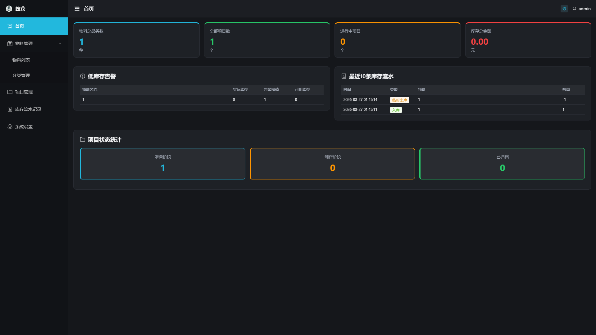
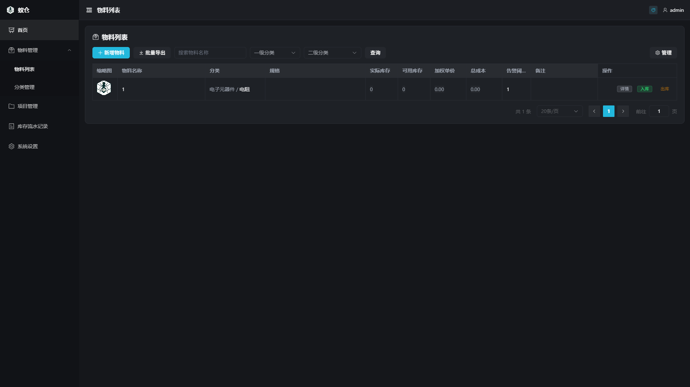
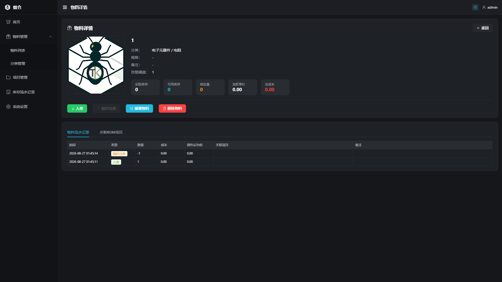
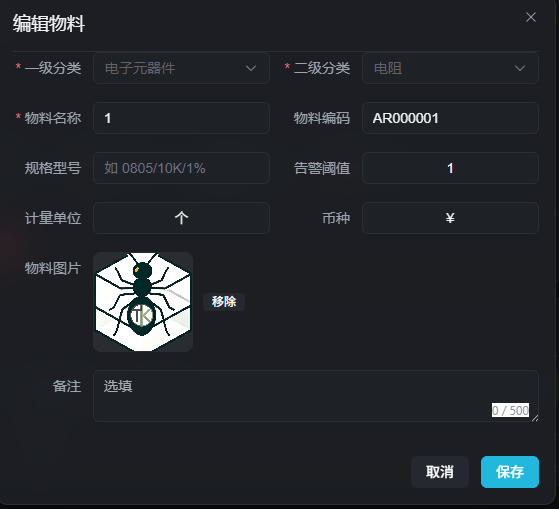
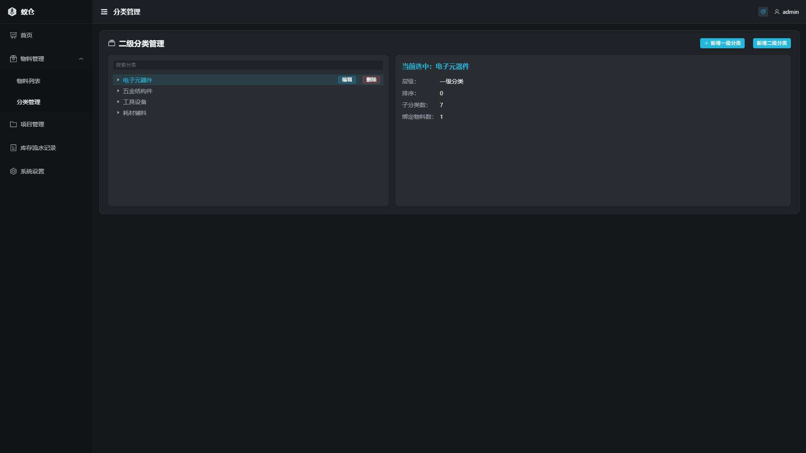
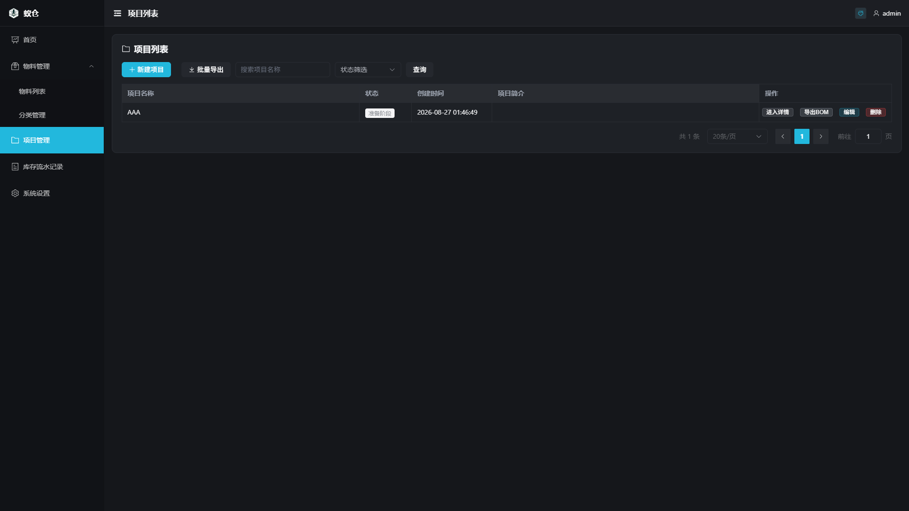
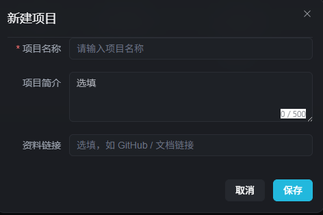
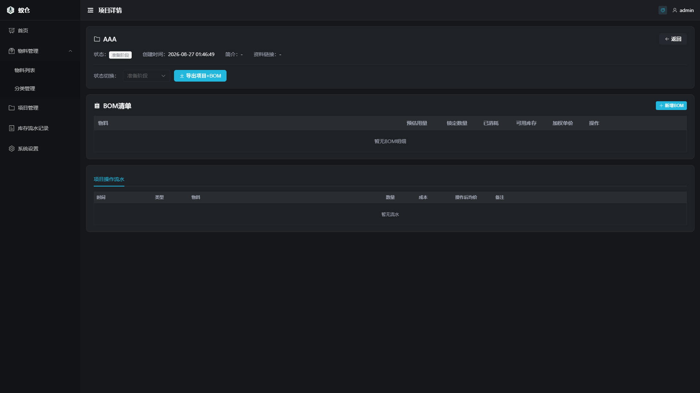
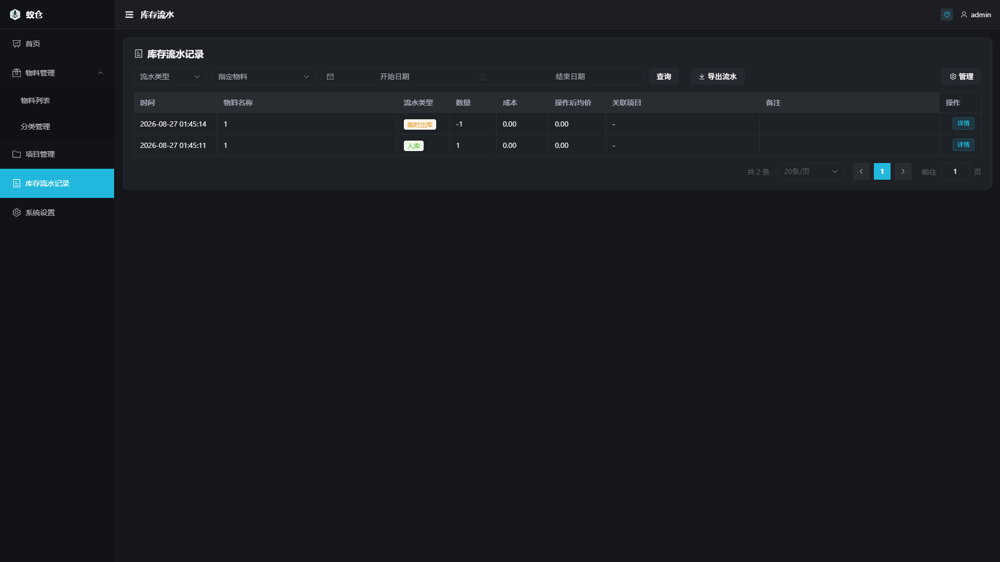
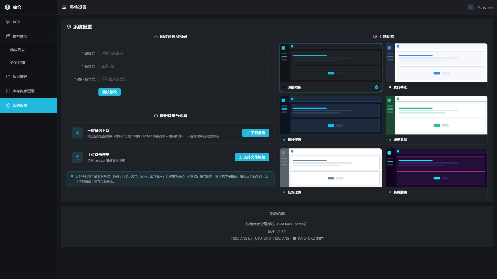

# 🐜 蚁仓 Ant Rack System (ANS) V1.1.1

> **全品类物料 · 项目 · 库存管理系统**
>
> 网页端 + 移动端 App（开发中）
>
> 制作者：TUTUTUKU · 项目编号 TK02

---

## ✨ 蚁仓是什么？

蚁仓是一款精简的「物料与项目库存管理系统」，专为创客、DIY 玩家、手工创作者的制造场景设计——从「一颗螺丝、一张贴纸、一根线材」的零散小件，到「一个大项目需要几十种物料」的配套管理，都能安排得清清楚楚。

它既没有 Excel 系统的混乱，也没有工业库管软件的复杂操作和流程，将小规模库存管理变成随手就能做完的一件小事。

### 它有什么优点？

- **自动计算成本**：每次入库、出库、借出都会自动计算最新的平均成本和库存总值。
- **库存流水清晰**：手里还有多少东西、用在哪里、哪个项目消耗了什么，一眼能看到；随时查、随时导出。
- **项目用料追踪**：给项目建一个「物料清单（BOM）」，项目做到一半也不会忘记「还差哪几样、还剩多少」。
- **轻松本地部署**：可以在自己电脑后台长期运行，也能装到 NAS、软路由或任意 Linux 服务器上 7×24 小时挂着。
- **数据自己掌控**：数据全部存在你自己的电脑/服务器里，不会上传到任何云端；还能一键导出备份文件，误操作了随时还原。
- **上手难度超低**：界面简单明了，菜单分级简练。浏览器直接打开就能用，没有复杂的权限和配置，默认一个管理员账号管全部。
- **未来扩展**：未来增加 App 功能，可以手机操作，扫码匹配，轻量管理。

### 它适合用来做什么？

| 场景 | 能帮你做什么 |
| --- | --- |
| **工作室 / 小工厂** | 管理零件、辅料、耗材，避免漏采、囤错、账目不清 |
| **DIY 玩家 / 手工爱好者** | 小到电阻电容、线材贴纸，大到木板电机，都能分类管理 |
| **模型 / RC / 3D 打印** | 零件种类多、数量碎，扫一下就知道剩多少 |
| **道具 / 服装 / 影视制作** | 项目多、物料杂，BOM 帮你把每个项目的配套清单锁死 |
| **学校 / 社团 / 实验室** | 多人共用耗材，出库一查就知道「谁领了多少、用在哪个项目」 |

---

## 🖼 功能预览

### 1 · 仪表盘：物料 / 项目 / 流水 / 库存总值一眼全览


有数据后的仪表盘，低库存预警、最近流水、项目进度一目了然：



### 2 · 物料管理：全品类建档、扫码即用

物料列表，按一/二级分类筛选，支持搜索、批量导出：



物料详情页，入库、出库、编辑、打印二维码、查看历史流水，一应俱全：



编辑物料，图片、编码、规格、单位、币种、告警阈值完整字段：



### 3 · 分类管理：两级分类，层级清晰



### 4 · 项目管理：BOM 清单 + 三状态闭环（准备 → 制作 → 已归档）

项目列表，支持创建、进入详情、编辑、删除、归档：



新建项目，名称 + 简介 + 资料链接（比如 GitHub 仓库）：



项目详情，BOM 物料清单 + 状态切换 + 项目流水 + 导出 BOM：



### 5 · 库存流水：每一笔入库 / 出库 / 临时出库都可追溯



### 6 · 系统设置：改密码、换主题、一键备份 / 恢复、查看版本

6 套主题可选（默认深曜暗夜），一键下载 / 上传 `.antrack` 备份，更新迁移不用怕：



---

## 🚀 快速部署

### 🪟 方式一：Windows 本地部署

> 适合自己电脑长期使用。

**前提条件**

- 已安装 **Python 3.10**（百度搜「Python 3.10」下载，安装时记得勾选 *Add to PATH*）
- 已安装 **Node.js 18+**（搜「Node.js LTS」一路下一步即可）

**步骤 1：下载源码**

1. 浏览器打开：https://github.com/TUTUTUKU/AntRack-Web
2. 点右上角绿色 **Code → Download ZIP**
3. 解压到任意空目录（例如 `D:\AntRack`），进入解压后 `antrack-web` 子目录

**步骤 2：启动后端**

进入 `antrack-web\backend` 文件夹，地址栏输入 `cmd` 回车（或开一个命令行窗口 `cd` 到该目录），执行：

```bash
pip install -r requirements.txt
python main.py
```

看到提示 `Uvicorn running on http://0.0.0.0:8000` 即成功，这个窗口不能关。

> **更省事的方法**：直接双击项目里的 `01_启动后端_后台静默.bat`，后端会后台运行（没有窗口）。想长期开机自动运行，就双击 `97_安装Windows服务.bat` 注册成系统服务。

**步骤 3：启动前端**

新开一个命令行窗口，进入 `antrack-web\frontend` 文件夹：

```bash
npm install      # 首次运行，耐心等它装完（约 2-5 分钟）
npm run dev
```

看到 `Local: http://localhost:5173` 即成功，这个窗口也不能关。

**步骤 4：打开使用**

浏览器访问：http://localhost:5173

> 默认账号：`admin` ｜ 默认密码：`admin123`
> 登录后立刻去「系统设置 → 修改管理员密码」改掉！

**以后怎么启动？**

以后每次开机，只需：

1. 双击 `01_启动后端_后台静默.bat`（或已装服务会自动启动）
2. 开命令行 `cd frontend && npm run dev`
3. 浏览器照旧访问 http://localhost:5173

停止后端：双击 `02_停止后端.bat`

---

### 🐳 方式二：Docker 部署

> 适合 NAS / 软路由 / Linux 服务器 / Ubuntu · 7×24 小时挂机。

**前提条件**

- 已安装 **Docker** 和 **Docker Compose**
- 如果是 Ubuntu，先在终端执行：
  ```bash
  sudo apt install docker.io docker-compose
  sudo systemctl enable --now docker
  ```

**步骤 1：下载源码 + 拉镜像 + 启动**

终端依次执行：

```bash
git clone https://github.com/TUTUTUKU/AntRack-Web.git
cd AntRack-Web
docker compose pull backend frontend
docker compose up -d
```

看到两个容器都 `started` 即完成。

> **说明**：`docker compose pull` 拉取 GitHub 已编译好的镜像（无需本机构建，速度快）。第一次如果镜像拉不到，可以改成 `docker compose up -d --build` 在本地慢慢构建。

**步骤 2：打开使用**

浏览器访问（把 IP 换成机器的局域网 IP）：

```
http://<机器IP>:8080
```

> 默认账号：`admin` ｜ 默认密码：`admin123`（登录后立刻改密码）

**以后怎么更新？**

源码有新版本时，在项目目录下执行：

```bash
git pull
docker compose pull backend frontend
docker compose up -d --force-recreate
```

> 数据不会丢。为了更稳妥，每次更新前可以先在「系统设置 → 数据备份与恢复 → 下载备份」存一份到本地电脑。

**常用运维命令**

| 想做什么 | 命令 |
| --- | --- |
| 看后端运行日志 | `docker compose logs -f backend` |
| 看前端运行日志 | `docker compose logs -f frontend` |
| 停止服务 | `docker compose stop` |
| 重启服务 | `docker compose restart` |
| 彻底卸载容器 | `docker compose down` |

> ⚠️ **绝对不要在 `docker compose down` 后面加 `-v`，也不要用 Portainer 删数据卷，会把库存数据清空！**

---

## 🔑 默认账号

| 用户名 | 密码 | 说明 |
| --- | --- | --- |
| `admin` | `admin123` | 首次启动自动创建 · **登录后立即到系统设置修改** |

---

> 💡 **小贴士**：两种方式数据格式完全通用——Windows 版导出的 `.antrack` 备份可以在 Docker 版恢复，反过来也行。
